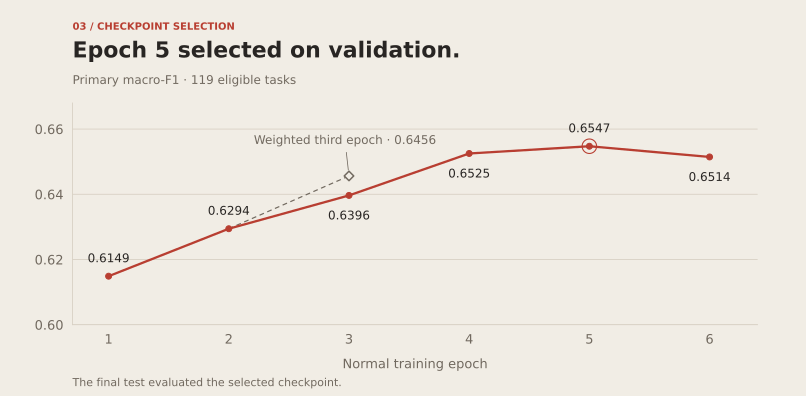

# Qwen3-8B on MAUD

[](https://github.com/intelligent-iterations/maud-qwen/actions/workflows/ci.yml)
[](https://github.com/intelligent-iterations/maud-qwen/actions/workflows/codeql.yml)
[](https://scorecard.dev/viewer/?uri=github.com/intelligent-iterations/maud-qwen)

A reproducible experiment in fine-tuning a local language model to answer predefined M&A deal-point questions from supplied contract passages. Qwen3-8B was trained with **4-bit QLoRA on one RTX 3090 (24 GB)** and evaluated on whole merger agreements excluded from fine-tuning.

This repository contains the experiment setup, frozen splits, scoring code, training loop and published predictions. **The selected fine-tune improved the primary metric; rare-answer recall remains a limitation.**

## Results

The final test contains **5,283 examples from 23 held-out agreements**, with 119 eligible question/subquestion tasks. Epoch five was selected using validation before any final-test predictions.

| System | Macro-F1 · primary | Accuracy | Rare correct | Rare recall | Rare precision |
| --- | ---: | ---: | ---: | ---: | ---: |
| Training-majority baseline | 0.4016 | 81.13% | 0/154 | 0.00% | — |
| Untuned Qwen3-8B | 0.3661 | 48.93% | 66/154 | 42.86% | 4.83% |
| **QLoRA · selected epoch 5** | **0.6788** | **89.04%** | **57/154** | **37.01%** | **54.81%** |

The tuned-minus-base macro-F1 difference is **+0.3128**, with a paired 95% agreement-bootstrap interval of **[0.2612, 0.3323]** (2,000 resamples, seed 42). Invalid outputs fell from six to zero. Both model evaluations had zero runtime truncation. Removing 94 preflagged overlap rows left macro-F1 at 0.3668 versus 0.6791.

The adapter answered nine fewer rare cases correctly, but incorrect rare-label predictions fell from **1,300 to 47**. The exploratory rare-recall difference interval includes zero. Precision and recall should be read together.

These are results for supplied passages and predefined answers, from **one training seed**. They do not establish general legal expertise, full-contract retrieval or performance on new legal tasks. Our whole-agreement split differs from MAUD's official splits; do not compare these numbers directly with published MAUD benchmark scores.

[Full test report](results/published/final-test-report.md) · [Machine-readable verification](results/published/final-test-verification.json) · [Evaluation protocol](docs/evaluation_protocol.md)

## Experiments

One normal trajectory ran for six epochs at learning rate `3e-5`. A separate branch resumed the same epoch-two checkpoint and gave rare-target examples **3× loss weight** for an alternative third epoch. It preserved example order, optimizer state and the original schedule.

| Validation checkpoint | Macro-F1 | Accuracy | Rare correct |
| --- | ---: | ---: | ---: |
| Untuned Qwen3-8B | 0.3531 | 49.45% | 82/154 |
| Epoch 1 | 0.6149 | 87.25% | 56/154 |
| Epoch 2 | 0.6294 | 88.28% | 49/154 |
| Epoch 3 | 0.6396 | 88.58% | 59/154 |
| Weighted epoch 3 | 0.6456 | 89.03% | 56/154 |
| Epoch 4 | 0.6525 | 88.92% | 58/154 |
| **Epoch 5 · selected** | **0.6547** | **88.56%** | **62/154** |
| Epoch 6 | 0.6514 | 88.06% | 63/154 |

Validation contains 5,043 examples from 23 agreements. The weighted branch did not meet its predefined rare-recall goal. Its macro-F1 difference from normal epoch three was +0.0060, with interval [−0.0040, 0.0148]. It is retained as an unsuccessful intervention. Later normal-epoch differences were small; epoch five won the predefined selection rule, not a claim of universal optimality.



[Experiment journal and error analysis](docs/experiments.md) · [All validation metrics](results/published/all-checkpoints-validation-summary.json)

## Reproduce the published scores on CPU

Python 3.12 is recommended. No model download, GPU, model API or MLflow server is needed for this path. Run commands from the repository root:

```bash
git clone https://github.com/intelligent-iterations/maud-qwen.git
cd maud-qwen
python3.12 -m venv .venv
source .venv/bin/activate
python -m pip install -e .
python -m maud_qwen prepare
python scripts/reproduce_results.py
```

`prepare` downloads the pinned official MAUD release, reconstructs passage files using the existing agreement assignments and verifies frozen hashes. It refuses to repartition. The audit then checks all 12 published prediction sets against those rows, recomputes final/validation scores and paired intervals, and writes a receipt under `outputs/reproduction/`.

Published JSONL predictions are compressed losslessly and include raw answers, labels, IDs, prompt/passage hashes, token counts and timing where applicable. They contain no full contract passages. Original JSONL hashes and compressed-file hashes are recorded in [the prediction manifest](results/published/predictions.json).

## Re-run fine-tuning

Use a Linux CUDA machine with sufficient VRAM; the recorded setup used an RTX 3090. Install the CUDA Torch build before the training extras:

```bash
python -m pip install torch==2.11.0 --index-url https://download.pytorch.org/whl/cu128
python -m pip install -e '.[train,test]'
python -m maud_qwen prepare
python -m maud_qwen lengths
python -m maud_qwen majority
bash scripts/run_first.sh
```

The launcher verifies frozen inputs, runs evaluator tests, a 32-example untuned evaluation, the longest-passage backward test and uninterrupted-versus-resumed training checks. It then evaluates the full untuned validation baseline, estimates runtime from measured throughput, and starts training. Each epoch is validated; selection uses macro-F1, earliest checkpoint on ties, patience two, and a six-epoch ceiling.

Training updates are supervised only on the answer letter and EOS. Prompt and padding tokens are masked. Natural-frequency sampling means one pass through all 25,225 training rows per epoch.

| Setting | Recorded value |
| --- | --- |
| Quantization / compute | NF4, double quantization, BF16 compute; FP32 adapters |
| LoRA | Rank 8, alpha 16, dropout 0; attention and MLP projections |
| Effective batch | Microbatch 1 × accumulation 16 |
| Optimizer | AdamW, learning rate 3e-5, weight decay 0.01 |
| Schedule | Cosine; 284 warmup steps of 9,462 |
| Context | 4,096 tokens; full passage or explicit error |
| Runtime | Gradient checkpointing, deterministic algorithms, TF32 off |
| Tracking | MLflow, SQLite and local artifacts by default |

The recorded throughput was approximately **26.6 seconds per optimizer step**, or **12–13 hours per epoch including validation**, under a 200 W GPU cap and a 3 GHz CPU cap. Benchmark your machine before estimating completion. [The reproduction guide](docs/reproduction.md) covers dependencies, thermal controls, resumption, the weighted branch, MLflow and final selection.

**Model weights and trained adapters are not bundled.** The included predictions reproduce the reported scores without them; re-running training produces a new adapter. GPU execution of this packaging must pass its own smoke checks. Cross-hardware bitwise equivalence is not guaranteed.

## Dataset and evaluation design

MAUD's official rows contain 25,827 training, 6,753 validation and 6,651 test examples. The audit independently confirmed that main-data rows from all 152 source agreements appear in each official split.

| Our partition | Agreements | Examples |
| --- | ---: | ---: |
| Train | 106 | 25,225 |
| Validation | 23 | 5,043 |
| Test | 23 | 5,283 |

Related main/abridged examples stay with their source. The primary experiment excludes 3,680 counterfactual examples with ambiguous provenance. Split manifests were frozen before model experiments. Duplicate and support audits are included.

Primary macro-F1 averages all valid labels within each eligible task, then weights tasks equally. Eligibility and rare labels are defined from training support. Invalid answers count as wrong. MAUD minority-class AUPR is not reported because generated letters are not continuous option scores.

[Data audit](docs/data_audit.md) · [Frozen protocol](docs/evaluation_protocol.md) · [Methods and research sources](docs/methods.md)

## Repository guide

- `src/maud_qwen/`: preparation, prompts, deterministic scoring, QLoRA training and evaluation.
- `configs/` and `manifests/`: pinned recipe, runtime policy and frozen data identities.
- `results/published/`: immutable original results, selection record and 12 prediction sets.
- `tests/`: scoring, supervision, weighted-loss and recovery checks.
- `docs/`: methodology, experiment journal, reproduction and publication provenance.
- `reports/maud-fine-tuning.html`: standalone illustrated article; download and open locally.

This repository is a curated public snapshot with a fresh Git history. Machine-specific deployment scripts and private operations history are excluded. [Provenance](docs/provenance.md) distinguishes original experiment identities from packaging changes.

## Further work and contributions

Proposed studies include repeated training seeds, a training-only passage-quality audit, and a predefined joint search over learning rate, duration and rare-example weight. These have not been run. The current final test was previously published and remains closed to tuning; a new confirmatory study needs previously unused agreements.

See [CONTRIBUTING.md](CONTRIBUTING.md) for local checks and experiment boundaries, and [SECURITY.md](SECURITY.md) for leak checks and private vulnerability reporting. No paid CI or model API service is configured.

## License and attribution

Original code and documentation: [Apache-2.0](LICENSE). MAUD-derived labels, question strings and metadata retain **CC BY 4.0** attribution to The Atticus Project and the MAUD authors. Qwen3-8B is separately licensed by its authors. See [NOTICE](NOTICE) for source links and license boundaries.

This is a literature-informed QLoRA adaptation, not an official MAUD/Qwen release or exact reproduction of the original MAUD encoder experiments.
